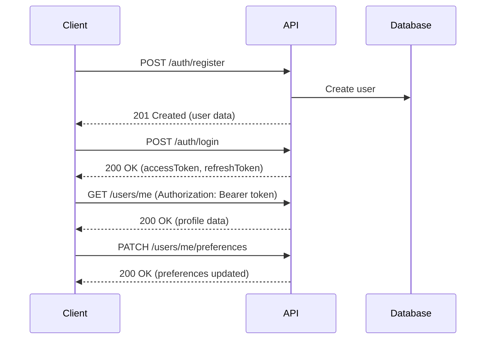
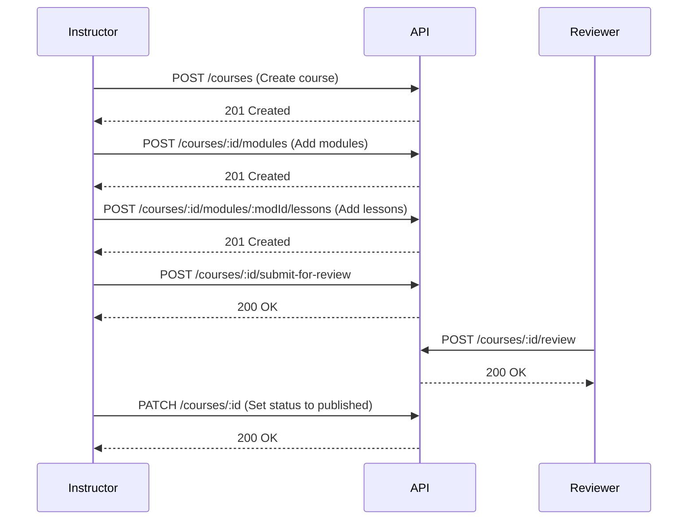
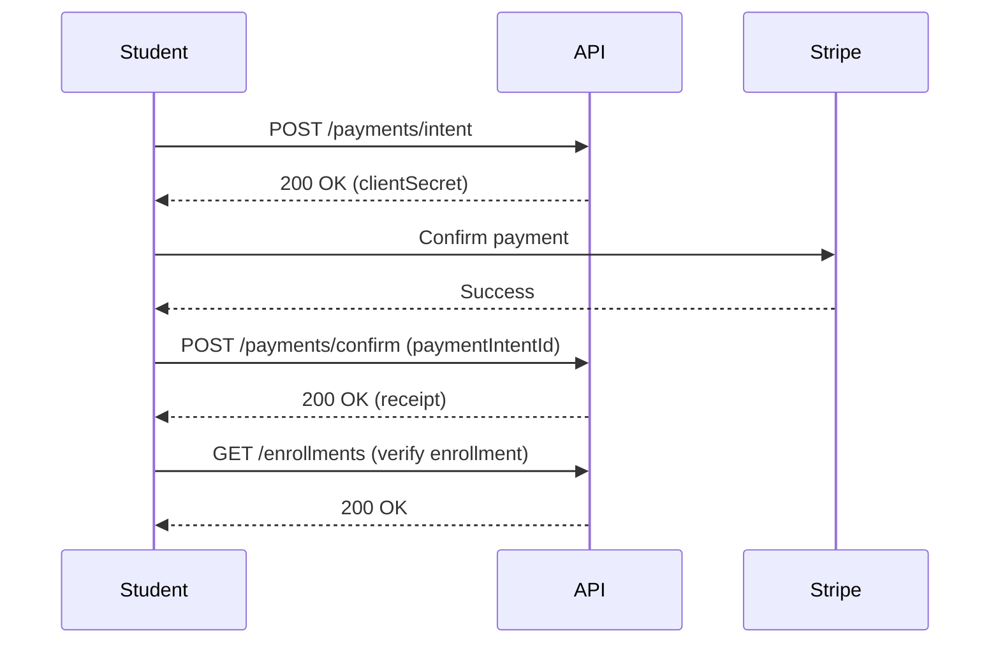
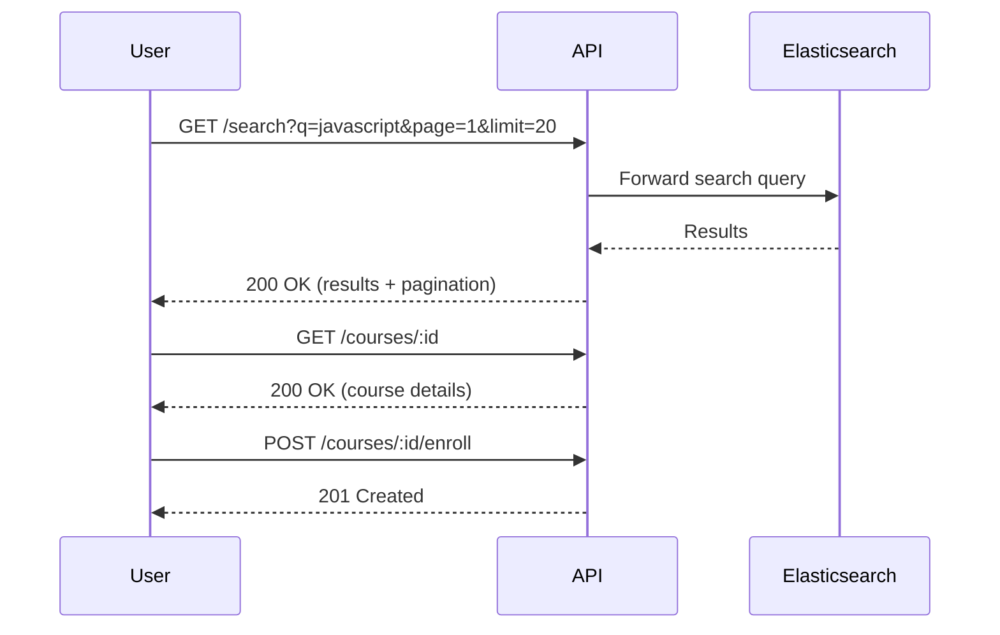
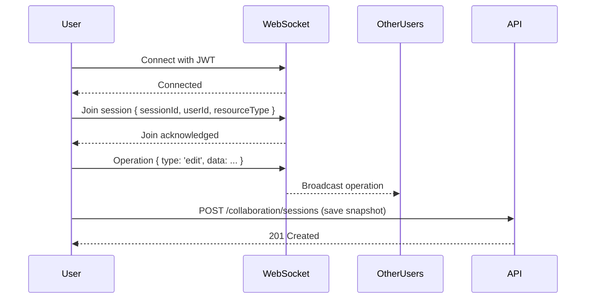
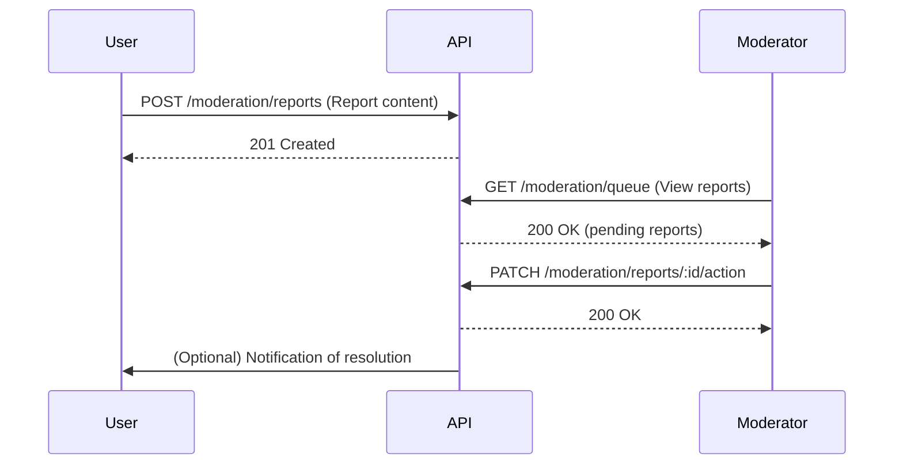

# Common Workflows

## User Registration & Onboarding

### Steps:
1. **Register** — `POST /auth/register` with email, password, and name
2. **Login** — `POST /auth/login` to receive JWT tokens
3. **Get Profile** — `GET /users/me` with the access token
4. **Set Preferences** — `PATCH /users/me/preferences` for locale, timezone, notifications

## Course Creation & Publishing

### Steps:
1. **Create Course** — `POST /courses` with title, description, price
2. **Add Modules** — `POST /courses/:id/modules` for each module
3. **Add Lessons** — `POST /courses/:id/modules/:modId/lessons` for each lesson
4. **Submit for Review** — `POST /courses/:id/submit-for-review`
5. **Review** — Reviewer calls `POST /courses/:id/review`
6. **Publish** — `PATCH /courses/:id` with `status: published`

## Payment Flow

### Steps:
1. **Create Payment Intent** — `POST /payments/intent` with courseId, amount, currency
2. **Confirm on Client** — Use Stripe.js to confirm the payment
3. **Confirm on Server** — `POST /payments/confirm` with the payment intent ID
4. **Verify Enrollment** — `GET /enrollments` to confirm access

## Search & Discovery

### Steps:
1. **Search** — `GET /search?q=<term>` for full-text search
2. **Filter** — Add `?category=`, `?price[gte]=`, `?sort=` for refinement
3. **View Course** — `GET /courses/:id` for details
4. **Enroll** — `POST /courses/:id/enroll`

## Real-Time Collaboration

### Steps:
1. **Connect** — Open WebSocket connection with JWT in query params
2. **Join** — Send `JoinSession` message to start collaborating
3. **Operate** — Send `CollaborativeOperation` messages in real-time
4. **Save** — Periodically save to REST API via `POST /collaboration/sessions`

## Moderation Queue

### Steps:
1. **Report Content** — `POST /moderation/reports` with resource type, ID, and reason
2. **Review Queue** — `GET /moderation/queue` for pending reports (moderator role)
3. **Take Action** — `PATCH /moderation/reports/:id/action` to resolve
